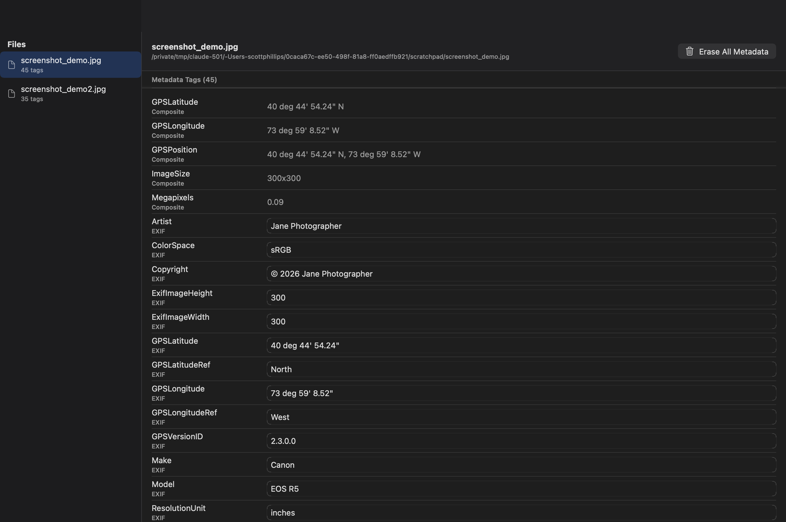
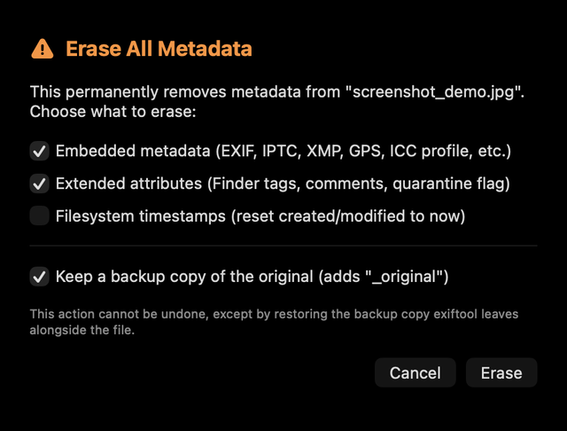

# MetaWipe

A native macOS app for viewing, editing, and erasing file metadata — EXIF/IPTC/XMP, GPS location, extended attributes (Finder comments/tags), and filesystem timestamps.

[**Download MetaWipe-1.2.5.dmg**](https://github.com/ScottPhillips/MetaWipe/releases/latest)



## Features

- View and filter all metadata tags on any file, grouped by source (EXIF, IPTC, XMP, GPS, etc.)
- Edit and save individual tag values
- View and remove individual extended attributes
- Edit filesystem creation/modification timestamps
- One-click **Erase All Metadata**, with separate toggles for embedded metadata, extended attributes, and timestamps, and an option to keep a backup copy
- **Check for Updates…** menu command (also checks silently on launch) that compares against the latest GitHub release
- Finder integration: right-click any file → **Services** → **Edit Meta Tags** (opens it in MetaWipe) or **Strip Meta Tags** (silently erases embedded metadata + extended attributes, keeping a backup)



## Installing

Download the DMG from the [latest release](https://github.com/ScottPhillips/MetaWipe/releases/latest), open it, and drag MetaWipe to Applications.

This build is signed with a Developer ID and notarized by Apple, so it opens normally — no Gatekeeper warning or right-click workaround needed.

### Enabling the Finder services

macOS ships new Services disabled by default, so after installing (or updating), open **System Settings → Keyboard → Keyboard Shortcuts… → Services → Files and Folders**, and check the boxes for **Edit Meta Tags** and **Strip Meta Tags**. This is a one-time step; they'll then show up under right-click → Services for any file.

## Building from source

MetaWipe wraps [exiftool](https://exiftool.org) (vendored in `MetaWipe/Resources/ExifTool` so the built app works standalone) and uses [XcodeGen](https://github.com/yonaskolb/XcodeGen) to generate the Xcode project:

```
brew install xcodegen
xcodegen generate
open MetaWipe.xcodeproj
```
